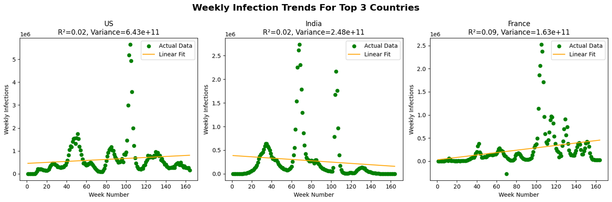
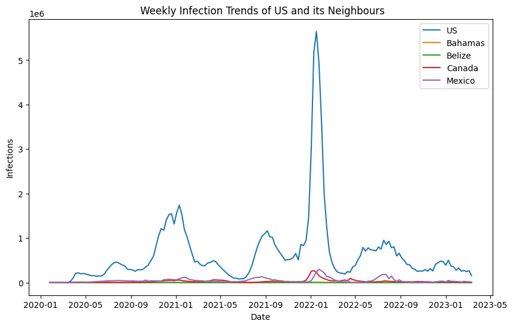
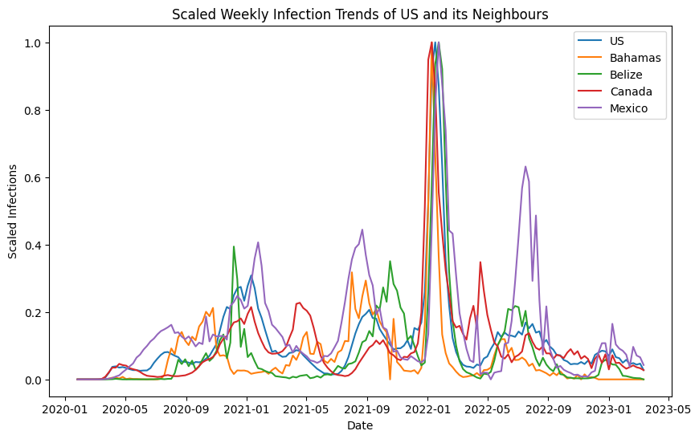
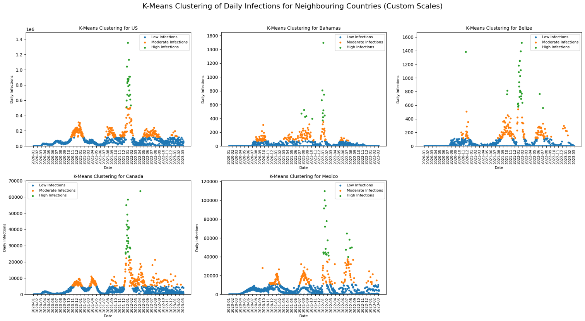
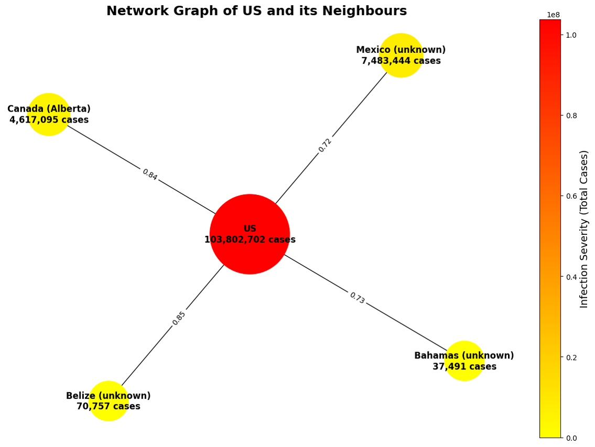

# COVID-19 Infection Trends Analysis

**Python | Pandas | Scikit-learn | NetworkX | Data Visualisation**

## Project Overview

This project analyses COVID-19 infection trends using global time-series data. The aim was to identify infection patterns, compare neighbouring countries, and provide data-driven recommendations for public health decision-making.

The United States was selected as the focal country because it showed the highest variation in weekly infection trends compared with other highly infected countries.

## Dataset

The dataset was sourced from the Johns Hopkins University COVID-19 time-series repository.

Dataset used:

https://raw.githubusercontent.com/CSSEGISandData/COVID-19/master/csse_covid_19_data/csse_covid_19_time_series/time_series_covid19_confirmed_global.csv

The dataset contains cumulative daily confirmed COVID-19 cases by country and province/state. The data was imported directly into Google Colab using Python.

## Business Questions

- Which countries had the highest COVID-19 infection counts?
- Which country showed the highest variation in weekly infections?
- How did the United States compare with its neighbouring countries?
- Do neighbouring countries show similar infection patterns over time?
- Can clustering identify low, moderate, and high infection periods?
- What recommendations can be made to support public health decision-making?

## Methodology

### 1. Data Preparation

The dataset was cleaned and prepared using Python and Pandas. Missing values were handled in the province/state, country/region, latitude, and longitude columns.

The cumulative daily case counts were transformed into non-cumulative daily infections and then aggregated into weekly infection totals for trend analysis.

### 2. Predictive Modelling

Linear regression was used to analyse weekly infection trends. The model evaluated:

- R² score
- variance
- regression trend lines

The United States was selected as the focal country because it showed the highest weekly infection variance.

### 3. K-Means Clustering

K-Means clustering was used to group infection periods into:

- Low infections
- Moderate infections
- High infections

This helped identify periods where countries experienced significant infection spikes.

### 4. Graph Analytics

Network analysis was used to explore relationships between the United States and selected neighbouring countries.

Neighbouring countries were identified using geographical distance, and relationships were analysed using infection trend correlations.

### 5. Visualisation

The project used visualisations to communicate findings clearly, including:

- Weekly infection trend graphs
- Scaled trend comparisons
- K-Means clustering plots
- Network graphs
- Variance comparison visuals

## Key Findings

- The United States had the highest infection variance and was selected as the focal country.
- The largest infection peak occurred around January 2022.
- Canada and Mexico showed similar infection patterns to the United States.
- Belize and the Bahamas showed smaller but still visible infection peaks.
- K-Means clustering identified clear low, moderate, and high infection periods.
- Network analysis showed that neighbouring countries had related infection trends.

## Visualisations

### Selected Country Analysis



### Weekly Infection Trends



### Scaled Infection Trends



### K-Means Clustering



### Network Graph Analysis



## Recommendations

Based on the analysis, the following recommendations were made:

1. **Monitor infection peaks**
   - Use early warning systems to detect major increases in infection counts.

2. **Apply targeted interventions**
   - Use short-term measures during high-infection periods instead of broad long-term restrictions.

3. **Strengthen regional collaboration**
   - Improve data sharing and coordinated responses between neighbouring countries.

4. **Allocate health resources based on infection severity**
   - Prioritise healthcare staff, hospital capacity, and vaccines during high-risk periods.

5. **Use advanced predictive models**
   - Future work could use more advanced models to better capture non-linear infection trends.

## Technologies Used

- Python
- Pandas
- NumPy
- Matplotlib
- Scikit-learn
- NetworkX
- Geopy
- Google Colab

## Repository Structure

```text
covid19-infection-trends-analysis/
├── code.ipynb
├── README.md
└── images/
    ├── us-selection-variance.png
    ├── weekly-infection-trends.png
    ├── scaled-infection-trends.png
    ├── kmeans-clustering.png
    └── network-graph.png
```

## Author

**Lynda Nyamira**  
Master of Information Technology  
Aspiring Data Analyst
